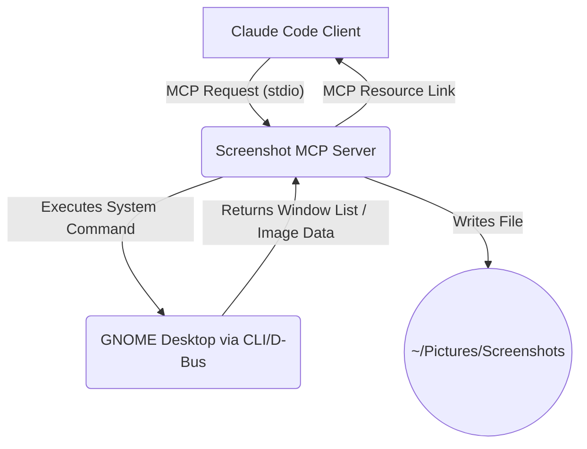

Understood. Engaging YOLO mode.

I will now generate the complete draft of the **Screenshot MCP Server Architecture Document** based on our discussion and my architectural best practices. This document will be a comprehensive first version. Please review it carefully, as we are bypassing the iterative section-by-section refinement.

-----

# Screenshot MCP Server Architecture Document

## Introduction

This document outlines the overall project architecture for the Screenshot MCP Server. Its primary goal is to serve as the guiding architectural blueprint for an AI-driven development agent. The server will provide tools to an LLM client (such as Claude Code) enabling it to programmatically capture the screen, list application windows, and capture specific windows within a GNOME (Wayland/Mutter) desktop environment. The server will operate as a local process, launched by the MCP client, and will manage screenshots within the user's `~/Pictures/Screenshots` directory.

### Starter Template or Existing Project

This is a greenfield project. Based on user selection, we will use the official **Python MCP SDK** and associated project structure as our foundation.

### Change Log

| Date | Version | Description | Author |
| :--- | :--- | :--- | :--- |
| 2025-07-10 | 1.0 | Initial architectural draft | Winston (Architect) |

## High Level Architecture

### Technical Summary

This architecture defines a lightweight, single-process MCP server written in Python. It will be launched by a host client (e.g., Claude Code) and communicate over the `stdio` transport mechanism. The server's primary function is to expose the host machine's desktop environment to an LLM by providing `Tools` for listing open windows and capturing screenshots. Captured images will be saved to the local filesystem and exposed back to the client as MCP `Resources`. The core technical challenge to be addressed is the programmatic, non-interactive capture of specific windows within a Wayland-based environment.

### High Level Overview

The server is designed as a monolithic service responsible for all screenshot-related tasks. It will operate within a single repository. The fundamental interaction flow is as follows: The client requests a list of open windows; the server executes a system command to get this list and returns it. The client (or the LLM through it) then requests a screenshot of a specific window ID from that list. The server executes a second system command to perform the capture, saves the image to `~/Pictures/Screenshots`, and returns a `Resource` link to the client. This approach provides a clear and secure workflow, with the server acting as a trusted bridge to the desktop environment.

### High Level Project Diagram



### Architectural and Design Patterns

  * [cite\_start]**Model Context Protocol (MCP) Server**: The server will adhere to the MCP specification, acting as a compliant server that provides context and capabilities to a client. [cite: 1901]
  * [cite\_start]**Stdio Transport**: For simplicity and security in a local environment, the server will communicate with the client using standard input/output streams. [cite: 894] [cite\_start]This is ideal for processes launched and managed by a host application like an IDE. [cite: 895]
  * **Tool Primitive**: The server will expose its core functionality as `Tools`. [cite\_start]This is the correct primitive for model-controlled, executable functions. [cite: 817, 1923]
  * **Resource Primitive**: The output screenshots will be exposed as `Resources`, allowing the client to read their content as needed. [cite\_start]This is the standard pattern for exposing data and content to LLMs. [cite: 759, 1921]

## Tech Stack

### Technology Stack Table

| Category | Technology | Version | Purpose | Rationale |
| :--- | :--- | :--- | :--- | :--- |
| **Language** | Python | 3.10+ | Primary development language | [cite\_start]Modern, stable, with excellent support for system-level scripting. [cite: 1214] |
| **Runtime** | Python | 3.10+ | Server execution environment | Aligns with language choice. |
| **Framework** | FastMCP | \>=1.2.0 | Core MCP server implementation | [cite\_start]Uses Python type hints and docstrings to automatically generate tool definitions, simplifying development. [cite: 1221] |
| **Dependency Mgt** | uv | latest | Project setup & package management | [cite\_start]Fast, modern tool for Python project and environment management. [cite: 1216, 1217] |
| **API Style** | MCP `Tools` | 2025-06-18 | Server-client communication | [cite\_start]The native protocol for exposing executable functions to LLMs. [cite: 1967] |
| **Testing** | pytest | latest | Unit and integration testing | Standard, powerful, and flexible testing framework for Python. |
| **Logging** | logging | built-in | Standard library logging | [cite\_start]Provides robust logging to stderr, which can be captured by the MCP host client. [cite: 965] |

## Data Models

### Window

  * **Purpose:** Represents a single, capturable application window discovered on the user's desktop.
  * **Key Attributes:**
      * `id`: `string` - A unique, system-provided identifier that can be used to target the window for capture.
      * `title`: `string` - The human-readable title of the window.
  * **Relationships:** None. This is a simple data structure returned by the `list_windows` tool.

## Components

### ScreenshotServer

  * **Responsibility:** A single component that implements the full MCP server logic. It listens for requests from the client, executes underlying system commands to interact with the desktop, manages file I/O, and formats responses according to the MCP specification.
  * **Key Interfaces:**
      * `tools/list`: Exposes the available screenshot tools.
      * `tools/call`: Executes a specific tool (`list_windows`, `capture_window`, etc.).
      * `resources/list`: Lists available screenshots in the designated directory.
      * `resources/read`: Reads the data of a specific screenshot file.
  * **Dependencies:** `GNOME Desktop Interface` (see below).

## External APIs

### GNOME Desktop Interface

  * **Purpose:** To programmatically list open windows and trigger captures.
  * **Documentation:** *To be determined during implementation.* This is the key research item.
  * **Authentication:** None required; relies on local user execution permissions.
  * **Key Endpoints Used (Conceptual):**
      * `list-windows-command`: A command-line tool or D-Bus call that outputs a structured list of window IDs and titles.
      * `capture-window-command`: A command-line tool or D-Bus call that takes a window ID and a file path as arguments to save a capture of that window.
  * **Integration Notes:** The server will wrap these system commands. The implementation must be robust against command failures or unexpected output.

## REST API Spec

Not applicable. This server uses the Model Context Protocol, not REST.

## Database Schema

Not applicable. This server is stateless and does not use a database.

## Source Tree

The project will follow a standard, simple Python application structure.

```plaintext
screenshot-server/
├── .venv/                     # Virtual environment (git-ignored)
├── server.py                  # Main server logic and tool definitions
├── pyproject.toml             # Project dependencies and configuration
└── README.md                  # Project documentation
```

## Infrastructure and Deployment

  * **Deployment Strategy:** The server is a local executable script intended to be launched directly by an MCP host client (like Claude Code) using the `stdio` transport. [cite\_start]Configuration is handled within the client's `claude_desktop_config.json` or equivalent. [cite: 1238, 1241]
  * **Environments:** There is a single "local" execution environment.
  * **Rollback Strategy:** Managed by the user, by reverting to a previous version of the `server.py` script.

## Error Handling Strategy

  * **Tool Execution Errors:** Any failure in an underlying system command (e.g., window not found, capture fails) will be caught within a `try...except` block in the Python code. [cite\_start]The MCP tool will then return a `CallToolResult` with `isError` set to `true` and the `content` field containing the `stderr` or a descriptive error message. [cite: 850] This makes errors visible to the LLM.
  * **Logging:** Detailed errors, including full stack traces, will be logged to `stderr` using the standard Python `logging` module. [cite\_start]This allows the host client to capture and store detailed debug information in its log files. [cite: 965]

## Coding Standards

  * **Style & Linting:** The project will use `ruff` for linting and `black` for code formatting to ensure consistency.
  * **Critical Rules:**
      * All arguments passed to shell commands (e.g., `filename`) **MUST** be sanitized to prevent command injection vulnerabilities.
      * File path arguments **MUST** be validated to ensure they are constrained within the `~/Pictures/Screenshots` directory, preventing directory traversal attacks.

## Test Strategy and Standards

  * **Framework:** `pytest` will be used for all testing.
  * **Unit Tests:** Will mock the `subprocess.run` calls to test the MCP server logic (argument parsing, response formatting) without executing actual system commands.
  * **Integration Tests:** A separate test suite that can be run manually will execute the actual system commands to verify that image files are created as expected. These tests will require a running GNOME desktop session.

## Security

  * **Command Injection:** The server MUST treat all inputs from the client as untrusted. Any data used to construct a shell command must be strictly sanitized or passed as separate arguments to `subprocess.run` to prevent command injection.
  * **Filesystem Access:** The server's logic must ensure that all file operations are strictly contained within the `~/Pictures/Screenshots` directory. It should use `pathlib.Path.resolve()` to normalize paths and verify they are children of the allowed directory before performing any write operations.
  * **Permissions:** The server runs with the same permissions as the user who launched the host client. The architecture does not require or request elevated privileges.

## Checklist Results Report

This is the initial architectural draft. The `architect-checklist` should be run against this document once it is considered stable to identify any gaps or areas for refinement.

## Next Steps

### Developer Handoff

The primary next step is to begin implementation. The first story should be to tackle the core technical challenge.

**Story 1.1: Implement Window Listing**

  * **Task 1: Research.** Identify the optimal command-line tool or D-Bus interface to programmatically list all open, non-minimized windows on GNOME with Wayland. The output must include a stable ID and a human-readable title for each window.
  * **Task 2: Implement.** Create the `list_windows` MCP tool in `server.py`. This tool will execute the command found in Task 1, parse its output, and return it as a list of `Window` objects (`{id: string, title: string}`).
  * **Task 3: Test.** Write unit tests that mock the output of the system command to ensure the parsing logic is correct.
